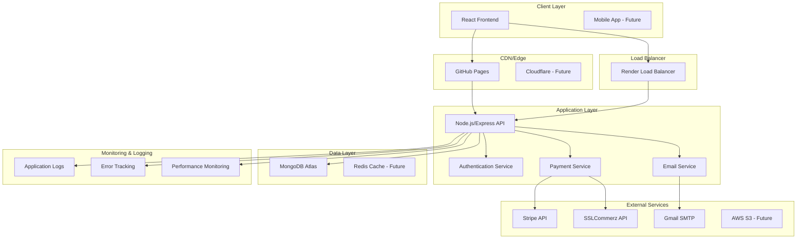
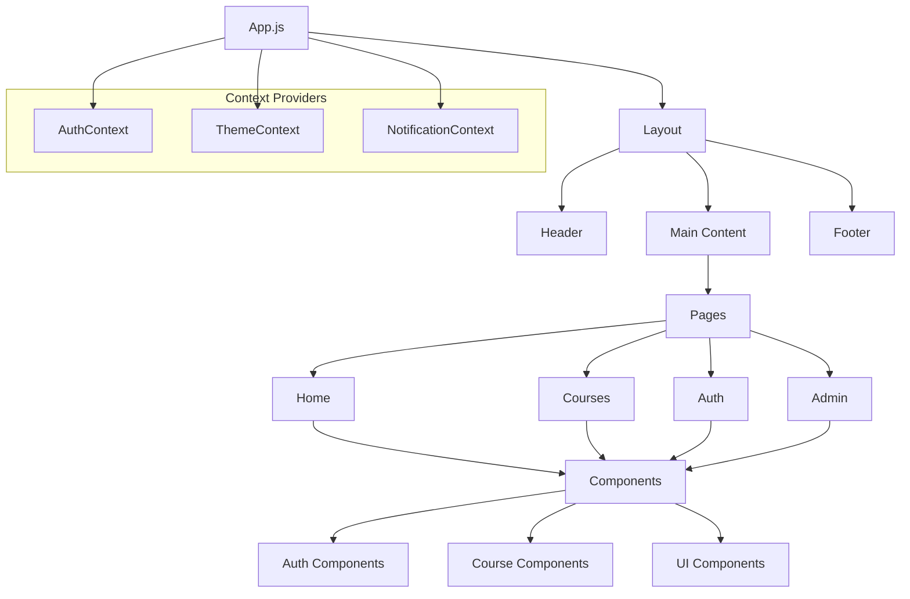
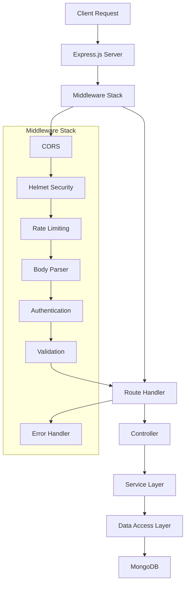
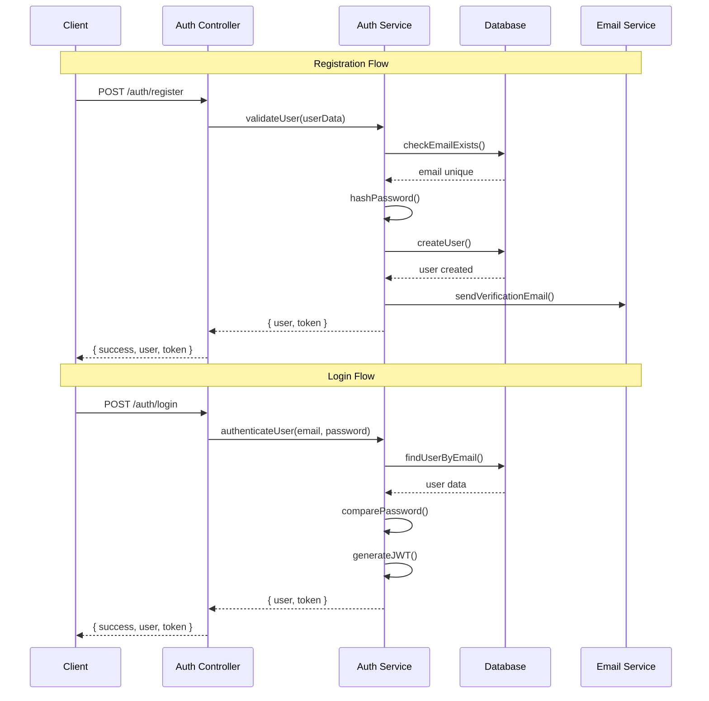
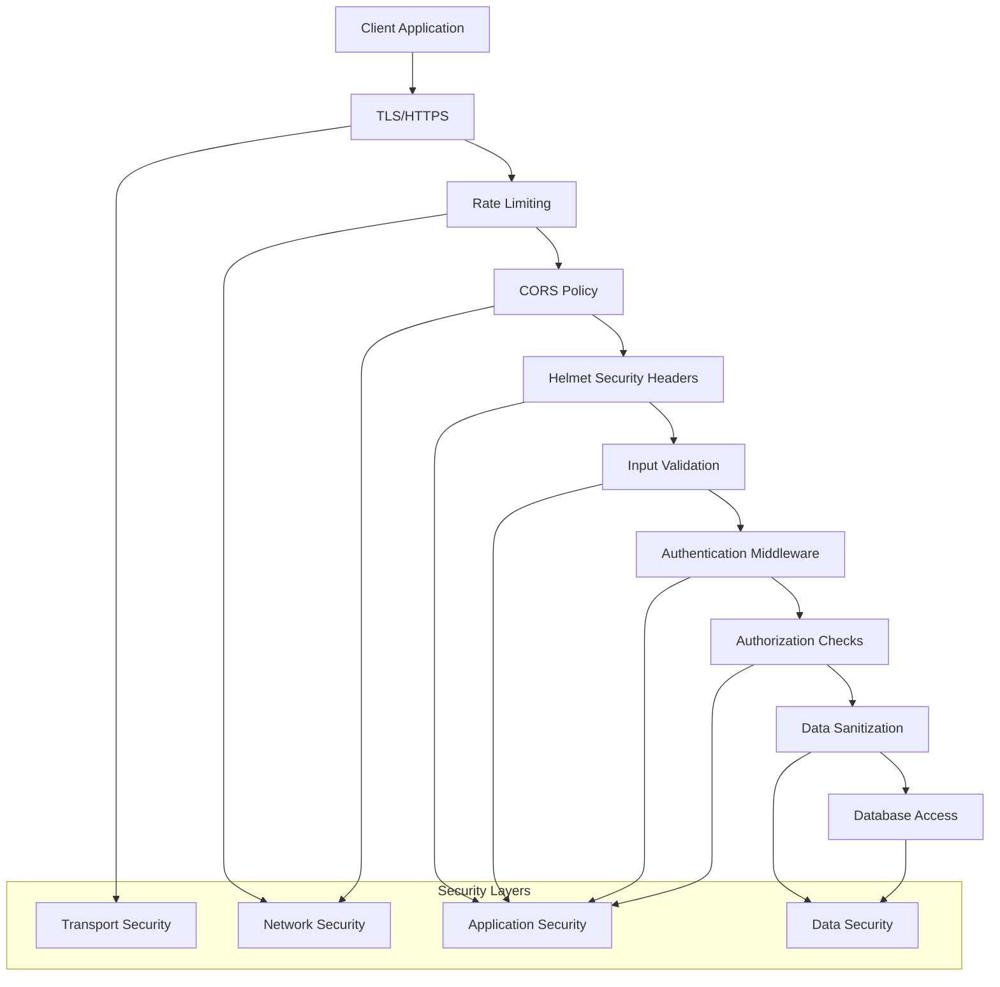
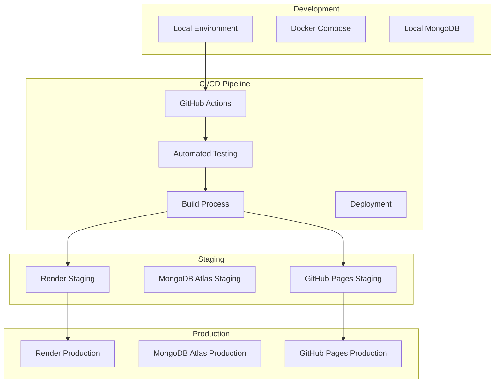
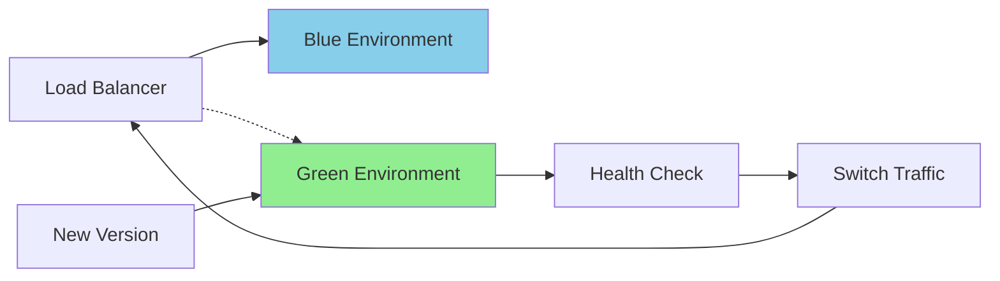
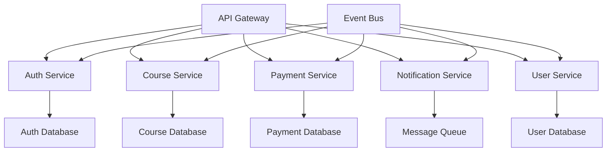

# 🏗️ System Architecture
## Students Enrollment System - Technical Architecture & Design

---

## 📋 Table of Contents

- [🎯 Overview](#-overview)
- [🏛️ High-Level Architecture](#️-high-level-architecture)
- [🔧 Technology Stack](#-technology-stack)
- [📱 Frontend Architecture](#-frontend-architecture)
- [⚙️ Backend Architecture](#️-backend-architecture)
- [🗄️ Database Design](#️-database-design)
- [🔐 Security Architecture](#-security-architecture)
- [🚀 Deployment Architecture](#-deployment-architecture)
- [📈 Scalability & Performance](#-scalability--performance)
- [🔄 CI/CD Pipeline](#-cicd-pipeline)

---

## 🎯 Overview

The Students Enrollment System is built using a modern **MERN stack** architecture with a focus on scalability, security, and maintainability. The system follows **microservices principles** while maintaining simplicity for current requirements, with the flexibility to evolve into a distributed architecture as needed.

### Core Principles

1. **Separation of Concerns**: Clear boundaries between presentation, business logic, and data layers
2. **Scalability**: Horizontal scaling capabilities with stateless design
3. **Security First**: Multi-layered security approach with defense in depth
4. **Developer Experience**: Modern tooling and development practices
5. **Performance**: Optimized for speed and efficiency
6. **Maintainability**: Clean code, comprehensive testing, and documentation

---

## 🏛️ High-Level Architecture



### Architecture Layers

| Layer | Technology | Purpose | Scalability |
|-------|------------|---------|-------------|
| **Presentation** | React.js, Material-UI | User interface and experience | CDN, lazy loading |
| **API Gateway** | Express.js middleware | Request routing, authentication | Load balancing |
| **Business Logic** | Node.js, Express.js | Core application logic | Horizontal scaling |
| **Data Access** | Mongoose ODM | Database abstraction | Connection pooling |
| **Data Storage** | MongoDB Atlas | Persistent data storage | Sharding, replication |
| **Caching** | Redis (planned) | Session and data caching | Clustering |

---

## 🔧 Technology Stack

### Frontend Stack

```yaml
Core Framework:
  - React.js 18.2.0: Component-based UI library
  - JavaScript ES6+: Modern JavaScript features
  - JSX: React syntax extension

UI Framework:
  - Material-UI (MUI) 5.14: Component library
  - Material Icons: Icon set
  - Responsive Design: Mobile-first approach

State Management:
  - React Context API: Global state management
  - React Hooks: Local state and effects
  - Custom Hooks: Reusable logic

Routing & Navigation:
  - React Router 6.17: Client-side routing
  - Browser History API: Navigation state

Data Fetching:
  - Axios: HTTP client
  - Async/Await: Promise handling
  - Error Boundaries: Error handling

Development Tools:
  - Create React App: Build toolchain
  - React DevTools: Debugging
  - ESLint + Prettier: Code quality
```

### Backend Stack

```yaml
Runtime Environment:
  - Node.js 18.x: JavaScript runtime
  - Bun: Package management

Web Framework:
  - Express.js 4.18: Web application framework
  - Express Middleware: Request processing pipeline

Database:
  - MongoDB 6.0: NoSQL document database
  - Mongoose 7.5: ODM for MongoDB
  - MongoDB Atlas: Cloud database hosting

Authentication & Security:
  - JWT: Token-based authentication
  - bcryptjs: Password hashing
  - Helmet: Security headers
  - CORS: Cross-origin resource sharing
  - Rate Limiting: API protection

Payment Processing:
  - Stripe API: Credit card processing
  - SSLCommerz: Local payment gateway
  - Webhook handling: Payment confirmations

Email Services:
  - Nodemailer: Email sending
  - Gmail OAuth 2.0: Secure authentication
  - HTML Templates: Rich email content

Development Tools:
  - Nodemon: Development server
  - Jest: Testing framework
  - Supertest: API testing
  - ESLint + Prettier: Code quality
```

### DevOps & Infrastructure

```yaml
Containerization:
  - Docker: Application containerization
  - Docker Compose: Multi-container orchestration

CI/CD:
  - GitHub Actions: Automated workflows
  - Automated Testing: Quality assurance
  - Automated Deployment: Continuous delivery

Hosting & Deployment:
  - Render: Backend hosting
  - GitHub Pages: Frontend hosting
  - MongoDB Atlas: Database hosting

Monitoring & Logging:
  - Application Logs: System monitoring
  - Health Checks: Service availability
  - Error Tracking: Issue identification

Version Control:
  - Git: Source code management
  - GitHub: Code repository and collaboration
```

---

## 📱 Frontend Architecture

### Component Architecture



### Folder Structure

```
client/src/
├── 📁 components/           # Reusable components
│   ├── 📁 Auth/            # Authentication components
│   │   ├── AdminRoute.js    # Admin route protection
│   │   └── ProtectedRoute.js # User route protection
│   ├── 📁 Layout/          # Layout components
│   │   ├── Header.js       # Application header
│   │   ├── Footer.js       # Application footer
│   │   └── Layout.js       # Main layout wrapper
│   ├── 📁 UI/              # UI components
│   │   ├── LoadingSpinner.js
│   │   ├── ErrorBoundary.js
│   │   └── ConfirmDialog.js
│   └── 📁 Course/          # Course-specific components
│       ├── CourseCard.js
│       ├── CourseFilter.js
│       └── EnrollmentForm.js
├── 📁 pages/               # Page components
│   ├── 📁 Auth/           # Authentication pages
│   │   ├── Login.js
│   │   ├── Register.js
│   │   ├── ForgotPassword.js
│   │   ├── ResetPassword.js
│   │   └── VerifyEmail.js
│   ├── 📁 Admin/          # Admin pages
│   │   ├── Dashboard.js
│   │   ├── Courses.js
│   │   ├── Users.js
│   │   ├── Enrollments.js
│   │   └── Payments.js
│   ├── 📁 Courses/        # Course pages
│   │   └── CourseDetail.js
│   ├── Home.js
│   ├── Courses.js
│   ├── Dashboard.js
│   └── Profile.js
├── 📁 context/            # React Context
│   └── AuthContext.js     # Authentication state
├── 📁 hooks/              # Custom hooks
│   ├── useAuth.js
│   ├── useApi.js
│   └── useLocalStorage.js
├── 📁 services/           # API services
│   ├── api.js             # Axios configuration
│   ├── authService.js     # Authentication API
│   ├── courseService.js   # Course API
│   └── paymentService.js  # Payment API
├── 📁 utils/              # Utility functions
│   ├── formatters.js      # Data formatting
│   ├── validators.js      # Form validation
│   └── constants.js       # Application constants
├── 📁 styles/             # Styling
│   ├── theme.js           # Material-UI theme
│   └── globals.css        # Global styles
├── App.js                 # Root component
└── index.js               # Application entry point
```

### State Management

#### Context API Implementation

```javascript
// AuthContext.js
export const AuthContext = createContext();

export const AuthProvider = ({ children }) => {
  const [user, setUser] = useState(null);
  const [loading, setLoading] = useState(true);
  const [token, setToken] = useState(localStorage.getItem('token'));

  // Authentication methods
  const login = async (email, password) => {
    try {
      const response = await authService.login(email, password);
      const { user, token } = response.data;
      
      setUser(user);
      setToken(token);
      localStorage.setItem('token', token);
      
      return { success: true, user };
    } catch (error) {
      return { success: false, error: error.message };
    }
  };

  const logout = () => {
    setUser(null);
    setToken(null);
    localStorage.removeItem('token');
  };

  const value = {
    user,
    token,
    loading,
    login,
    logout,
    isAuthenticated: !!user,
    isAdmin: user?.role === 'admin'
  };

  return <AuthContext.Provider value={value}>{children}</AuthContext.Provider>;
};
```

#### Custom Hooks

```javascript
// useAuth.js
export const useAuth = () => {
  const context = useContext(AuthContext);
  if (!context) {
    throw new Error('useAuth must be used within an AuthProvider');
  }
  return context;
};

// useApi.js
export const useApi = () => {
  const { token } = useAuth();
  
  const api = useMemo(() => {
    const instance = axios.create({
      baseURL: process.env.REACT_APP_API_URL || 'http://localhost:5001/api',
    });
    
    instance.interceptors.request.use((config) => {
      if (token) {
        config.headers.Authorization = `Bearer ${token}`;
      }
      return config;
    });
    
    return instance;
  }, [token]);
  
  return api;
};
```

### Routing Strategy

```javascript
// App.js routing
function App() {
  return (
    <AuthProvider>
      <ThemeProvider theme={theme}>
        <Router>
          <Layout>
            <Routes>
              {/* Public Routes */}
              <Route path="/" element={<Home />} />
              <Route path="/courses" element={<Courses />} />
              <Route path="/courses/:id" element={<CourseDetail />} />
              
              {/* Auth Routes */}
              <Route path="/login" element={<Login />} />
              <Route path="/register" element={<Register />} />
              <Route path="/forgot-password" element={<ForgotPassword />} />
              
              {/* Protected Routes */}
              <Route path="/dashboard" element={
                <ProtectedRoute>
                  <Dashboard />
                </ProtectedRoute>
              } />
              
              {/* Admin Routes */}
              <Route path="/admin/*" element={
                <AdminRoute>
                  <AdminRoutes />
                </AdminRoute>
              } />
            </Routes>
          </Layout>
        </Router>
      </ThemeProvider>
    </AuthProvider>
  );
}
```

---

## ⚙️ Backend Architecture

### API Architecture



### Folder Structure

```
server/
├── 📁 middleware/          # Custom middleware
│   ├── auth.js            # Authentication middleware
│   ├── validation.js      # Input validation
│   ├── errorHandler.js    # Error handling
│   └── rateLimiter.js     # Rate limiting
├── 📁 models/             # Mongoose models
│   ├── User.js           # User model
│   ├── Course.js         # Course model
│   ├── Enrollment.js     # Enrollment model
│   └── Payment.js        # Payment model
├── 📁 routes/            # Express routes
│   ├── auth.js          # Authentication routes
│   ├── courses.js       # Course management
│   ├── enrollments.js   # Enrollment handling
│   ├── payments.js      # Payment processing
│   ├── sslcommerz.js    # SSLCommerz integration
│   └── users.js         # User management
├── 📁 controllers/       # Route controllers
│   ├── authController.js
│   ├── courseController.js
│   ├── enrollmentController.js
│   └── paymentController.js
├── 📁 services/          # Business logic
│   ├── authService.js
│   ├── courseService.js
│   ├── paymentService.js
│   └── emailService.js
├── 📁 utils/             # Utility functions
│   ├── email.js         # Email utilities
│   ├── validators.js    # Data validation
│   ├── helpers.js       # General helpers
│   └── constants.js     # Application constants
└── 📁 config/            # Configuration
    ├── database.js      # Database config
    ├── email.js         # Email config
    └── payment.js       # Payment config
```

### Middleware Stack

```javascript
// server.js - Middleware configuration
const app = express();

// Security middleware
app.use(helmet());
app.use(cors({
  origin: process.env.CLIENT_URL,
  credentials: true
}));

// Rate limiting
app.use('/api/', rateLimit({
  windowMs: 15 * 60 * 1000, // 15 minutes
  max: 100 // limit each IP to 100 requests per windowMs
}));

// Body parsing
app.use(express.json({ limit: '10mb' }));
app.use(express.urlencoded({ extended: true }));

// Request logging
app.use(morgan('combined'));

// Routes
app.use('/api/auth', authRoutes);
app.use('/api/courses', courseRoutes);
app.use('/api/enrollments', enrollmentRoutes);
app.use('/api/payments', paymentRoutes);
app.use('/api/users', userRoutes);

// Error handling
app.use(errorHandler);
```

### Service Layer Pattern

```javascript
// services/courseService.js
class CourseService {
  async getAllCourses(filters, pagination) {
    const query = this.buildQuery(filters);
    const courses = await Course.find(query)
      .populate('instructor', 'name email')
      .sort(pagination.sort)
      .limit(pagination.limit)
      .skip(pagination.skip);
    
    const total = await Course.countDocuments(query);
    
    return {
      courses,
      pagination: {
        ...pagination,
        total,
        totalPages: Math.ceil(total / pagination.limit)
      }
    };
  }
  
  async getCourseById(id, userId = null) {
    const course = await Course.findById(id)
      .populate('instructor', 'name email bio avatar');
    
    if (!course) {
      throw new Error('Course not found');
    }
    
    // Check if user is enrolled (if userId provided)
    if (userId) {
      const enrollment = await Enrollment.findOne({
        user: userId,
        course: id,
        status: 'active'
      });
      course.isEnrolled = !!enrollment;
    }
    
    return course;
  }
  
  private buildQuery(filters) {
    const query = {};
    
    if (filters.category) query.category = filters.category;
    if (filters.level) query.level = filters.level;
    if (filters.search) {
      query.$text = { $search: filters.search };
    }
    
    return query;
  }
}

module.exports = new CourseService();
```

### Authentication Flow



---

## 🗄️ Database Design

### Data Modeling Strategy

Our database design follows these principles:

1. **Document-Oriented Design**: Leverage MongoDB's strengths
2. **Balanced Normalization**: Reference frequently changing data, embed stable data
3. **Query Optimization**: Design for common access patterns
4. **Scalability**: Support horizontal scaling

### Schema Design Patterns

#### Embedded Documents
```javascript
// Course curriculum embedded in Course document
curriculum: [{
  module: String,
  lessons: [{
    title: String,
    duration: String,
    type: String
  }]
}]
```

#### Referenced Documents
```javascript
// User reference in Enrollment
user: {
  type: mongoose.Schema.Types.ObjectId,
  ref: 'User',
  required: true
}
```

#### Hybrid Approach
```javascript
// Payment with embedded customer info and user reference
{
  user: ObjectId, // Reference for queries
  customer: {     // Embedded for performance
    name: String,
    email: String,
    address: Object
  }
}
```

---

## 🔐 Security Architecture

### Multi-Layer Security Approach



### Authentication & Authorization

#### JWT Token Structure
```javascript
// JWT Payload
{
  "userId": "64f123abc456def789012345",
  "email": "user@example.com",
  "role": "student",
  "iat": 1694776200,
  "exp": 1694779800
}

// JWT Implementation
const generateToken = (user) => {
  return jwt.sign(
    {
      userId: user._id,
      email: user.email,
      role: user.role
    },
    process.env.JWT_SECRET,
    { expiresIn: '1h' }
  );
};
```

#### Role-Based Access Control
```javascript
// Authorization middleware
const authorize = (roles = []) => {
  return (req, res, next) => {
    if (!req.user) {
      return res.status(401).json({ error: 'Authentication required' });
    }
    
    if (roles.length && !roles.includes(req.user.role)) {
      return res.status(403).json({ error: 'Insufficient permissions' });
    }
    
    next();
  };
};

// Usage in routes
router.get('/admin/users', authenticate, authorize(['admin']), getUsersController);
```

### Data Protection

#### Input Validation & Sanitization
```javascript
// Express validator middleware
const validateCourse = [
  body('title')
    .trim()
    .isLength({ min: 1, max: 200 })
    .escape(),
  body('price')
    .isFloat({ min: 0 })
    .toFloat(),
  body('description')
    .trim()
    .isLength({ min: 10, max: 500 })
    .escape()
];

// MongoDB injection prevention
app.use(mongoSanitize());

// XSS protection
app.use(xss());
```

#### Password Security
```javascript
// Password hashing with bcrypt
const hashPassword = async (password) => {
  const saltRounds = 12;
  return await bcrypt.hash(password, saltRounds);
};

// Password validation
const passwordSchema = {
  minLength: 8,
  requireUppercase: true,
  requireLowercase: true,
  requireNumbers: true,
  requireSpecialChars: false
};
```

---

## 🚀 Deployment Architecture

### Multi-Environment Strategy



### Container Strategy

#### Docker Configuration
```dockerfile
# Multi-stage Dockerfile
FROM node:18-alpine AS builder
WORKDIR /app
COPY package*.json ./
RUN bun install --production --frozen-lockfile

FROM node:18-alpine AS runtime
WORKDIR /app
COPY --from=builder /app/node_modules ./node_modules
COPY . .
EXPOSE 5001
CMD ["bun", "start"]
```

#### Docker Compose
```yaml
# docker-compose.yml
version: '3.8'
services:
  app:
    build: .
    ports:
      - "5001:5001"
    environment:
      - NODE_ENV=development
      - MONGODB_URI=mongodb://mongo:27017/students_enrollment
    depends_on:
      - mongo
      
  mongo:
    image: mongo:6.0
    ports:
      - "27017:27017"
    volumes:
      - mongo_data:/data/db
      
volumes:
  mongo_data:
```

### Cloud Deployment

#### Render Configuration
```yaml
# render.yaml
services:
  - type: web
    name: students-enrollment-api
    env: node
    plan: starter
    buildCommand: bun install && bun run build
startCommand: bun start
    envVars:
      - key: NODE_ENV
        value: production
      - key: MONGODB_URI
        fromDatabase:
          name: students-enrollment-db
          property: connectionString
```

---

## 📈 Scalability & Performance

### Performance Optimization Strategies

#### Database Optimization
```javascript
// Connection pooling
mongoose.connect(MONGODB_URI, {
  maxPoolSize: 10,
  serverSelectionTimeoutMS: 5000,
  socketTimeoutMS: 45000
});

// Query optimization with indexes
courseSchema.index({ title: 'text', description: 'text' });
courseSchema.index({ category: 1, level: 1 });
courseSchema.index({ enrollmentCount: -1 });

// Pagination for large datasets
const getPaginatedCourses = async (page = 1, limit = 10) => {
  const skip = (page - 1) * limit;
  return await Course.find()
    .limit(limit)
    .skip(skip)
    .sort({ createdAt: -1 });
};
```

#### Caching Strategy (Future Implementation)
```javascript
// Redis caching
const redis = require('redis');
const client = redis.createClient(process.env.REDIS_URL);

const getCachedCourses = async (key) => {
  const cached = await client.get(key);
  if (cached) {
    return JSON.parse(cached);
  }
  
  const courses = await Course.find();
  await client.setex(key, 300, JSON.stringify(courses)); // 5 min cache
  return courses;
};
```

#### Frontend Performance
```javascript
// Code splitting with React.lazy
const CourseDetail = lazy(() => import('./pages/Courses/CourseDetail'));
const AdminDashboard = lazy(() => import('./pages/Admin/Dashboard'));

// Memoization for expensive calculations
const ExpensiveComponent = memo(({ data }) => {
  const processedData = useMemo(() => {
    return data.map(item => expensiveCalculation(item));
  }, [data]);
  
  return <div>{processedData}</div>;
});
```

### Horizontal Scaling Preparation

#### Stateless Design
```javascript
// Stateless authentication with JWT
const authenticate = (req, res, next) => {
  const token = req.headers.authorization?.split(' ')[1];
  
  try {
    const decoded = jwt.verify(token, process.env.JWT_SECRET);
    req.user = decoded;
    next();
  } catch (error) {
    res.status(401).json({ error: 'Invalid token' });
  }
};

// Session-less payment processing
const processPayment = async (paymentData) => {
  // All payment state managed by external provider (Stripe)
  const paymentIntent = await stripe.paymentIntents.create(paymentData);
  return paymentIntent;
};
```

---

## 🔄 CI/CD Pipeline

### GitHub Actions Workflow

```yaml
# .github/workflows/ci.yml
name: CI/CD Pipeline

on:
  push:
    branches: [main, develop]
  pull_request:
    branches: [main, develop]

jobs:
  lint:
    runs-on: ubuntu-latest
    steps:
      - uses: actions/checkout@v4
      - uses: actions/setup-node@v4
        with:
          node-version: '18'
          cache: 'bun'
      - run: bun install --frozen-lockfile
- run: bun run lint
- run: bun run format:check

  test:
    runs-on: ubuntu-latest
    services:
      mongodb:
        image: mongo:6.0
        ports:
          - 27017:27017
    steps:
      - uses: actions/checkout@v4
      - uses: actions/setup-node@v4
      - run: bun install --frozen-lockfile
- run: bun run test:backend
- run: bun run test:frontend

  build:
    needs: [lint, test]
    runs-on: ubuntu-latest
    steps:
      - uses: actions/checkout@v4
      - run: bun install --frozen-lockfile
- run: bun run build
      - uses: actions/upload-artifact@v4
        with:
          name: build-files
          path: client/build/

  deploy:
    needs: build
    runs-on: ubuntu-latest
    if: github.ref == 'refs/heads/main'
    steps:
      - name: Deploy to Production
        run: echo "Deploy to production"
```

### Deployment Strategy

#### Blue-Green Deployment (Future)


#### Rolling Updates
- Zero-downtime deployments
- Gradual traffic migration
- Automatic rollback on failure
- Health check validation

---

## 🔧 Monitoring & Observability

### Application Monitoring

```javascript
// Health check endpoint
app.get('/api/health', (req, res) => {
  const healthCheck = {
    status: 'healthy',
    timestamp: new Date().toISOString(),
    uptime: process.uptime(),
    environment: process.env.NODE_ENV,
    database: mongoose.connection.readyState === 1 ? 'connected' : 'disconnected',
    memory: process.memoryUsage()
  };
  
  res.status(200).json(healthCheck);
});

// Error tracking
const errorHandler = (err, req, res, next) => {
  console.error('Error:', {
    message: err.message,
    stack: err.stack,
    url: req.url,
    method: req.method,
    ip: req.ip,
    userAgent: req.get('User-Agent'),
    timestamp: new Date().toISOString()
  });
  
  res.status(err.status || 500).json({
    error: {
      message: err.message,
      status: err.status || 500
    }
  });
};
```

### Performance Metrics

```javascript
// Performance monitoring
const performanceMonitor = (req, res, next) => {
  const start = Date.now();
  
  res.on('finish', () => {
    const duration = Date.now() - start;
    console.log(`${req.method} ${req.url} - ${res.statusCode} - ${duration}ms`);
  });
  
  next();
};
```

---

## 📚 Future Architecture Considerations

### Microservices Evolution



### Technology Roadmap

| Phase | Timeline | Features | Technologies |
|-------|----------|----------|-------------|
| **Phase 1** | Current | Core functionality | MERN Stack, MongoDB |
| **Phase 2** | Q2 2024 | Performance optimization | Redis caching, CDN |
| **Phase 3** | Q3 2024 | Advanced features | Microservices, Event streaming |
| **Phase 4** | Q4 2024 | Mobile app | React Native, GraphQL |

---

## 📖 Documentation Links

- [Database Schema Documentation](DATABASE.md)
- [API Reference](API.md)
- [Deployment Guide](deployment/README.md)
- [Testing Strategy](TESTING.md)
- [Security Guidelines](SECURITY.md) 